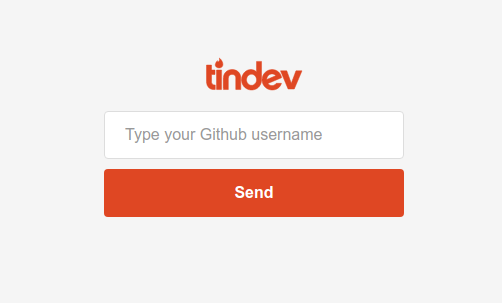
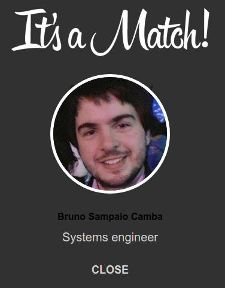

# Tindev
Have you ever wanted to look for other developers and maybe do some pair programming?

This is the repository for the Tindev (Tinder for developers) website/application developed during Omnistack week 8.0

## Composition

- Backend: Node
- Frontend: React
- Mobile: Reac-Native

## Running Locally

- docker-compose up to run both the backend and frontend applications. The frontend is exposed on localhost:3000 by default.

# Sample

